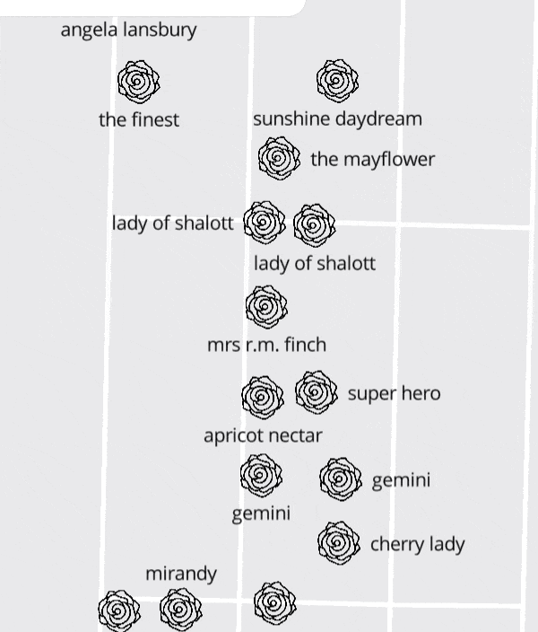

# 🌹 BBG Roses 🌹

[![Version][Version]][Version-url]

<a name="readme-top"></a>

<br />
<div align="center">
  <a href="https://github.com/seinwave/rose_garden">
    
  </a>

<h3 align="center">BBG Roses</h3>

  <p align="center">
    An enhanced rose-enjoying app, for discerning visitors of the <a href="https://www.bbg.org/">Brooklyn Bontanic Garden</a>.
    <br />
    <a href="https://github.com/seinwave/rose_garden"><strong>Explore the docs »</strong></a>
    <br />
    <br />
    <a href="https:www.bbgroses.com">View Demo</a> 
    ·
    <a href="https://github.com/seinwave/rose_garden/issues">Report Bug</a>
    ·
    <a href="https://github.com/seinwave/rose_garden/issues">Request Feature</a>
  </p>
</div>

<!-- TABLE OF CONTENTS -->
<details>
  <summary>Table of Contents</summary>
  <ol>
    <li>
      <a href="#about-the-project">About BBG Roses</a>
      <ul>
        <li><a href="#built-with">Built With</a></li>
      </ul>
    </li>
    <li>
      <a href="#running-locally">Running locally</a>
      <ul>
        <li><a href="#prerequisites">Prerequisites</a></li>
        <li><a href="#installation">Installation</a></li>
      </ul>
    </li>
    <li><a href="#project-status">Project status</a></li>
    <li><a href="#roadmap">Roadmap</a></li>
    <li><a href="#contributing">Contributing</a></li>
    <li><a href="#contact">Contact</a></li>
  </ol>
</details>

## About The Project

<p align="center">

</p>

About [800,000 people visit](https://en.wikipedia.org/wiki/Brooklyn_Botanic_Garden) the Brooklyn Botanic Garden each year. Many of them are bonafide rose-heads. But even for them, it can be hard to find their favorite blossoms among the 5,000+ flowers in BBG's [Cranford Rose Garden](https://www.bbg.org/collections/gardens/rose_garden).

That's who this app is for.

BBG Roses is here to help you find your favorite flowers, and remember where they are for your next visit!

<p align="right">(<a href="#readme-top">back to top</a>)</p>

### Built With

- [![Rails][Rails]][Rails-url]
- [![TypeScript][Typescript]][Typescript]
- [![Mapbox][Mapbox]][Mapbox-url]
- [![Hotwire][Hotwire]][Hotwire-url]

<p align="right">(<a href="#readme-top">back to top</a>)</p>

## Running Locally

Here's how to run BBG roses locally.

### Prerequisites

You're going to need

- Ruby (v. 3.2.2). Install using [rbenv](https://github.com/rbenv/rbenv) or [rvm](https://rvm.io/)

```ruby
# If using rbenv
rbenv install 3.2.2
rbenv global 3.2.2

# If using rvm
rvm install 3.2.2
rvm use 3.2.2
```

- Bundler

```sh
gem install bundler
```

- Rails (v. 7.0.8)

```sh
gem install rails
```

- Install Node.js and npm. The installation process will depend on your operating system. You can find instructions on the [official Node.js website](https://nodejs.org/en).

- Install Yarn. [Official Yarn website](https://yarnpkg.com/getting-started/install).

### Installation

1. Clone the repo
   ```sh
   git clone https://github.com/seinwave/rose_gardens.git
   ```
2. Install the rails dependencies
   ```sh
   bundle install
   ```
3. Install the node dependencies
   ```sh
   yarn install
   ```
4. Create the database
   ```sh
   rails db:create
   ```
5. Run the db migrations
   ```sh
   rails db:migrate
   ```
6. Seed the database
   ```sh
   rails db:seed
   ```
7. Start the server
   ```sh
    bin/dev
   ```
   (This final step will also compile your TypeScript code and start the webpack dev server.)

<p align="right">(<a href="#readme-top">back to top</a>)</p>

## Project Status

Right now, we're in a proof-of-concept phase. The finer points of the UI are still being worked out. But the core functionality is there. You can:

- See a map of the Cranford Rose Garden
- Sign up for a user account
- Search for roses
- Save roses to your favorites
- See your favorites on the map

As mentioned, a more beautiful and whimsical experience is in the offing. There are also a number of existing issues, which you can see [here](seinwave.github.com/rose_garden/issues).

<p align="right">(<a href="#readme-top">back to top</a>)</p>

## Roadmap

Here's what's to come -- the essentials to get BBG Roses to a 1.0 release.

- [ ] Favoriting is feature-complete
  - [ ] Including a "favorites" index to view all your favorited roses
- [ ] Search is feature-complete
  - [ ] A more sophisiticated search (currently we only search by name)
- [ ] The app handles rose images
  - [ ] Users can upload images of roses
  - [ ] Admin users can approve images
  - [ ] Images are displayed on the rose show page

<p align="right">(<a href="#readme-top">back to top</a>)</p>

## Contributing

This is a hobby project. I'm not looking for contributors right now. But if you want to take a look at the code, and have any suggestions, please feel free to open an issue!

<p align="right">(<a href="#readme-top">back to top</a>)</p>

## Contact

Questions? Comments? Suggestions? Please reach out!

Matt Seidholz - mseidholz@gmail.com

<p align="right">(<a href="#readme-top">back to top</a>)</p>

[Version]: https://img.shields.io/badge/0.1-189EFF?style=flat&logoColor=000000&label=Version&color=%23189EFF
[Version-url]: "#project-status"
[product-screenshot]: _repo_assets/screenshot.gif
[logo]: _repo_assets/rose-logo.png
[Rails]: https://img.shields.io/badge/rails-%23CC0000.svg?style=for-the-badge&logo=ruby-on-rails&logoColor=white
[Rails-url]: https://rubyonrails.org/
[Mapbox]: https://img.shields.io/badge/Mapbox-000000?style=for-the-badge&logo&logo=mapbox&link=https%3A%2F%2Fwww.mapbox.com%2F
[Mapbox-url]: https://www.mapbox.com/
[Typescript]: https://img.shields.io/badge/typescript-%23007ACC.svg?style=for-the-badge&logo=typescript&logoColor=white
[Typescript-url]: https://www.typescriptlang.org/
[Hotwire-url]: https://hotwired.dev/
[Hotwire]: https://img.shields.io/badge/Hotwire-FFE801?style=for-the-badge&logo=hotwire&logoColor=000000&link=https%3A%2F%2Fhotwired.dev%2F
[Hotwire-url]: https://hotwired.dev/
